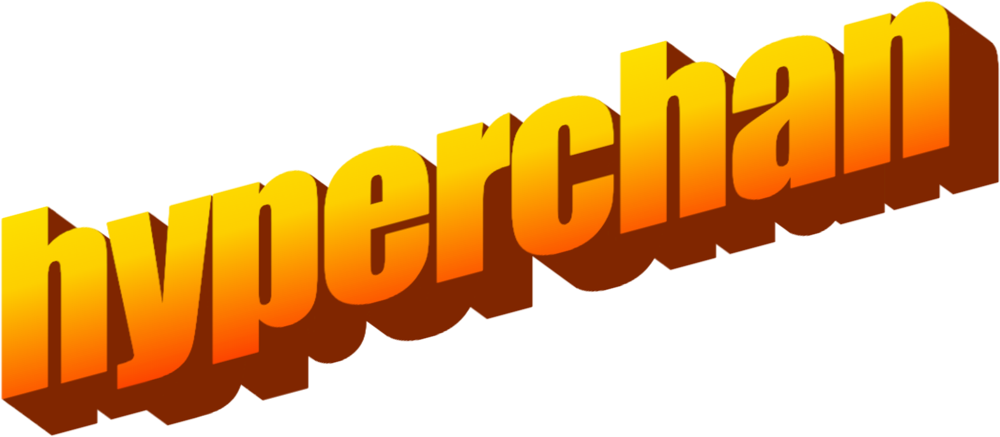

    

<h1 align="center">
    <strong>hyperchan</strong>
    

        the hypermedia-driven imageboard™
    

</h1>

# What is hyperchan?

**hyperchan** is a hypermedia-driven imageboard inspired by 2ch, 4chan, and other popular imageboard sites.

It is not intended to be a direct clone of any specific imageboard but will incorporate common features shared across them while introducing new and unique features of its own.

The goal is to create a hypermedia-driven imageboard using a modern, resilient, scalable, and **secure** tech stack.

The planned features of hyperchan include:

- a home page that displays recent threads and posts, and popular boards
- a simple thread and post architecture, for image and text posts
- admin/mod controlled boards, anonymous users can *request* a board but cannot *create* one
- GREENTEXT
- a simple, public API for viewing site stats
- a secure API for site administration and moderation
- ***more to come!***
